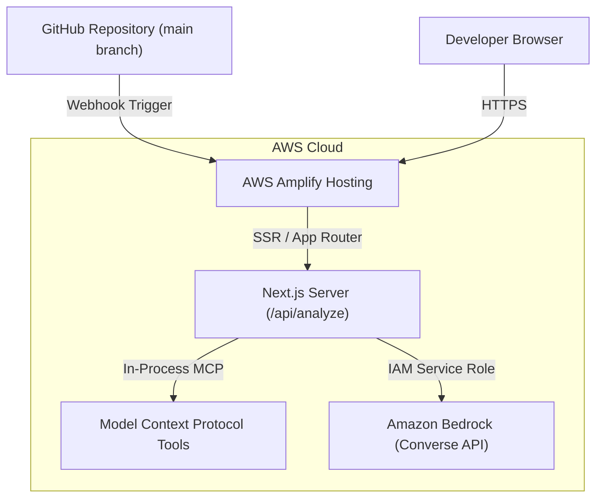

# Deployment Guide: MCP Developer Assistant on AWS Amplify

This guide walks you step-by-step through deploying the **MCP Developer Assistant** to **AWS Amplify Hosting** and connecting it to **Amazon Bedrock**.

---

## Architecture Overview



---

## Prerequisites

1. An **AWS Account** with access to the AWS Console.
2. A **GitHub Account** (repository created and pushed).
3. **Amazon Bedrock** model access enabled in your target region (e.g., `us-east-1` or `us-west-2`).

---

## Step 1: Enable Amazon Bedrock Model Access

1. Open the [AWS Management Console](https://console.aws.amazon.com/).
2. In the top navigation bar, ensure your region is set to **US East (N. Virginia) `us-east-1`** (or another Bedrock-supported region).
3. Navigate to **Amazon Bedrock**.
4. In the left sidebar, click **Model access**.
5. Click **Modify model access** or **Enable specific models**.
6. Select:
   - **Anthropic:** Claude 3 Haiku (`anthropic.claude-3-haiku-20240307-v1:0`)
   - *(Optional)* **Amazon:** Nova Micro (`amazon.nova-micro-v1:0`)
7. Click **Next** &rarr; **Submit**. Access is granted immediately in most regions.

---

## Step 2: Create the IAM Service Role for AWS Amplify

Amplify requires permission to invoke Bedrock models on your behalf:

1. In the AWS Console, open **IAM** &rarr; **Roles** &rarr; **Create role**.
2. Select **AWS service** as the trusted entity type.
3. Under *Use case*, choose **Amplify** (or select **Amplify - Backend Deployment**).
4. Click **Next**.
5. Click **Create policy** (opens in a new tab) &rarr; choose **JSON** &rarr; paste:
   ```json
   {
     "Version": "2012-10-17",
     "Statement": [
       {
         "Sid": "BedrockInvokeModelAccess",
         "Effect": "Allow",
         "Action": [
           "bedrock:InvokeModel",
           "bedrock:InvokeModelWithResponseStream"
         ],
         "Resource": [
           "arn:aws:bedrock:*:*:foundation-model/*"
         ]
       }
     ]
   }
   ```
6. Name the policy `AmplifyBedrockInvokePolicy` and save it.
7. Return to the role creation tab, refresh the policy list, select `AmplifyBedrockInvokePolicy`, and click **Next**.
8. Name the role `AmplifyDeveloperAssistantServiceRole` and click **Create role**.

---

## Step 3: Deploy the App in AWS Amplify

1. Navigate to **AWS Amplify** in the AWS Console.
2. Click **Create new app** &rarr; select **Host web app**.
3. Choose **GitHub** &rarr; click **Next**.
4. Authorize AWS Amplify to access your GitHub repositories.
5. Select repository: `mcp-developer-assistant`.
6. Select branch: `main`.
7. Click **Next**.

### App Settings Configuration:
- **Build specification:** Amplify will automatically detect the root [`amplify.yml`](./amplify.yml) file.
- Expand **Advanced settings**:
  - Add Environment Variable 1:
    - **Key:** `BEDROCK_AWS_REGION`
    - **Value:** `us-east-1`
  - Add Environment Variable 2:
    - **Key:** `BEDROCK_MODEL_ID`
    - **Value:** `amazon.nova-micro-v1:0`
- Under **App settings** &rarr; **General settings** &rarr; **Service role**:
  - Select the `AmplifyDeveloperAssistantServiceRole` created in Step 2.
8. Click **Next** &rarr; review your settings &rarr; click **Save and deploy**.

---

## Step 4: Verification & Live Testing

1. Wait 2–3 minutes for the build, deploy, and verify stages to turn green.
2. Click the provided public HTTPS URL (e.g., `https://main.d1234example.amplifyapp.com`).
3. Verify the application:
   - Click the **[PostgreSQL]** button (`ECONNREFUSED 127.0.0.1:5432`).
   - Click **Analyze Error**.
   - Observe the 4-stage stepper:
     - `✓ analyze_error`
     - `✓ find_possible_causes`
     - `✓ generate_debug_steps`
     - `✓ Amazon Bedrock`
   - Verify the diagnosis, severity badge, root causes, steps, and copyable commands.

---

## Troubleshooting Common Issues

### Issue 1: Bedrock "AccessDenied" or "ResourceNotFound"
- **Cause:** Model access not enabled in the region or service role not attached.
- **Fix:** Verify model access in AWS Bedrock console for `us-east-1` and ensure the Amplify App has `AmplifyDeveloperAssistantServiceRole` attached. The app will automatically fall back to deterministic MCP mode until permissions are active.

### Issue 2: Build Fails on Amplify
- **Cause:** Node.js version mismatch.
- **Fix:** In Amplify Console &rarr; **Build settings**, verify Node version is set to 20 or higher.
