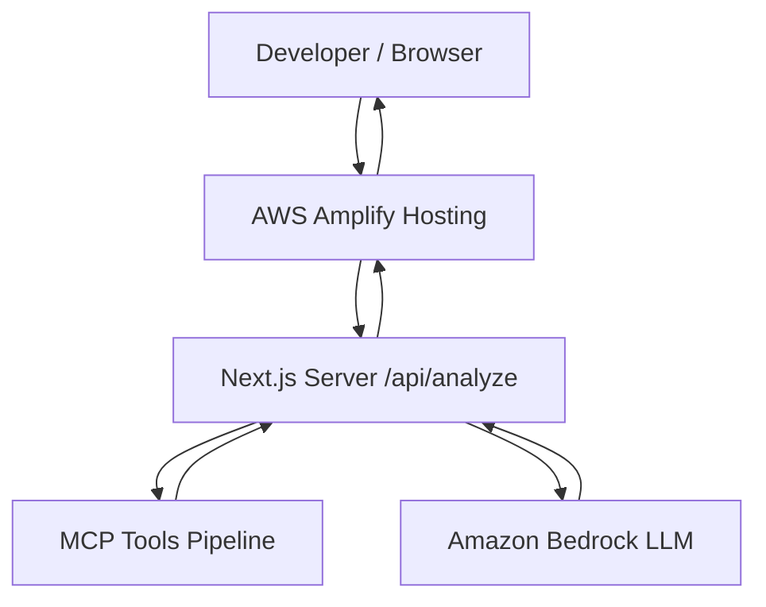

# MCP Developer Assistant

**MCP Developer Assistant** is a production-ready, serverless developer tool that diagnoses technical errors, container crashes, and system exceptions. Built for the AWS Builder Center *"Deploy Your First App Weekend Challenge"*, it combines the official **Model Context Protocol (MCP)** TypeScript SDK with **Amazon Bedrock** (Converse API) and deploys seamlessly to **AWS Amplify**.

---

## Demo

- **Live Demo:** [https://main.d19cqeoyrsnx7b.amplifyapp.com](https://main.d19cqeoyrsnx7b.amplifyapp.com)
- **GitHub Repository:** [https://github.com/kavix/mcp-developer-assistant](https://github.com/kavix/mcp-developer-assistant)
- **Demo Flow (60–90 seconds):**
  1. Paste a technical error (e.g. `ECONNREFUSED 127.0.0.1:5432` or `CrashLoopBackOff`).
  2. Click **Analyze Error**.
  3. Watch the real-time MCP activity stepper execute `analyze_error`, `find_possible_causes`, `generate_debug_steps`, and invoke `Amazon Bedrock`.
  4. Receive a structured diagnosis with severity, confidence, likely root causes, recommended checks, and copyable CLI commands.

---

## Features

- **AI Error Diagnosis:** High-precision developer troubleshooting synthesizing error messages and stack traces.
- **Official Model Context Protocol (MCP):** Employs `@modelcontextprotocol/sdk` in-process with `InMemoryTransport` connecting an MCP Client to an MCP Server.
- **Amazon Bedrock (Converse API):** Server-side LLM inference using AWS SDK for JavaScript v3 with model and region configurability.
- **Zero Database & Zero Docker:** Completely serverless and state-free; queries a deterministic in-memory TypeScript knowledge base.
- **Robust Fallback Resilience:** Returns deterministic MCP knowledge base findings if Bedrock credentials are unavailable or rate-limited.
- **Strict Security:** Zero client-side AWS credentials; 100% server-side execution.
- **AWS Amplify Ready:** Includes `amplify.yml` for instant Git-based Next.js App Router deployment.

---

## Architecture



### Server-Side Data Flow

```text
User enters error
       │
       ▼
POST /api/analyze (Next.js App Router)
       │
       ▼
MCP: analyze_error (category, technology, severity, summary)
       │
       ▼
MCP: find_possible_causes (queries root causes for tech + category)
       │
       ▼
MCP: generate_debug_steps (generates verification steps & shell commands)
       │
       ▼
Amazon Bedrock (Converse API synthesizes MCP findings)
       │
       ▼
Structured Diagnosis JSON + Tool Execution Telemetry
       │
       ▼
Interactive Frontend Dashboard
```

---

## MCP Tools

The application implements three Model Context Protocol tools compliant with the official MCP specification:

### 1. `analyze_error`
- **Purpose:** Categorizes the error message, identifies the affected technology stack (e.g., PostgreSQL, Kubernetes, Node.js, DNS, Reverse Proxy), assigns initial severity, and creates a concise technical summary.
- **Input:**
  ```json
  {
    "error": "ECONNREFUSED 127.0.0.1:5432"
  }
  ```
- **Output:**
  ```json
  {
    "category": "database_connection",
    "technology": "PostgreSQL",
    "severity": "medium",
    "summary": "The application cannot establish a TCP connection to PostgreSQL on port 5432."
  }
  ```

### 2. `find_possible_causes`
- **Purpose:** Discovers likely root causes for the specific error category and technology without hallucinating facts.
- **Input:**
  ```json
  {
    "category": "database_connection",
    "technology": "PostgreSQL"
  }
  ```
- **Output:**
  ```json
  {
    "causes": [
      "PostgreSQL service is not running or crashed",
      "PostgreSQL is listening on a different port or host interface",
      "The hostname or IP address is mismatched or unreachable",
      "A local or network firewall is blocking outbound/inbound traffic on port 5432",
      "PostgreSQL pg_hba.conf is rejecting the incoming client connection"
    ]
  }
  ```

### 3. `generate_debug_steps`
- **Purpose:** Produces sequential troubleshooting steps and verifiable shell commands tailored to the developer's issue.
- **Input:**
  ```json
  {
    "category": "database_connection",
    "technology": "PostgreSQL"
  }
  ```
- **Output:**
  ```json
  {
    "steps": [
      "Check whether PostgreSQL daemon is active and running",
      "Verify that port 5432 is in LISTEN state on the target interface",
      "Test raw TCP socket reachability using netcat or curl",
      "Inspect PostgreSQL server logs for startup or authentication failures"
    ],
    "commands": [
      "systemctl status postgresql",
      "ss -lntp | grep 5432",
      "nc -vz 127.0.0.1 5432"
    ]
  }
  ```

---

## Local Development

### Prerequisites
- Node.js 20+
- npm or pnpm
- AWS CLI configured (for Bedrock integration)

### Setup Instructions

1. **Clone the repository:**
   ```bash
   git clone https://github.com/your-org/mcp-developer-assistant.git
   cd mcp-developer-assistant
   ```

2. **Install dependencies:**
   ```bash
   npm install
   # or
   pnpm install
   ```

3. **Configure Environment Variables:**
   ```bash
   cp .env.example .env.local
   ```
   Edit `.env.local`:
   ```env
   AWS_REGION=us-east-1
   BEDROCK_MODEL_ID=anthropic.claude-3-haiku-20240307-v1:0
   ```

4. **Verify AWS CLI credentials:**
   ```bash
   aws sts get-caller-identity
   ```

5. **Run the development server:**
   ```bash
   npm run dev
   # or
   pnpm dev
   ```
   Open [http://localhost:3000](http://localhost:3000) in your browser.

6. **Run tests:**
   ```bash
   npm test
   # or
   pnpm test
   ```

7. **Verify production build:**
   ```bash
   npm run build
   ```

---

## AWS Setup

### 1. Amazon Bedrock Model Access
1. Sign in to the [AWS Management Console](https://console.aws.amazon.com/).
2. Navigate to **Amazon Bedrock** in your desired region (e.g., `us-east-1`, `us-west-2`, `eu-central-1`).
3. In the left navigation sidebar, select **Model access**.
4. Click **Modify model access** or **Enable specific models**.
5. Enable access to your chosen model:
   - **Anthropic Claude 3 Haiku:** `anthropic.claude-3-haiku-20240307-v1:0` (Fast, cost-effective)
   - **Amazon Nova Micro / Lite:** `amazon.nova-micro-v1:0` / `amazon.nova-lite-v1:0`
   - **Anthropic Claude 3.5 Sonnet:** `anthropic.claude-3-5-sonnet-20240620-v1:0`

### 2. IAM Least-Privilege Permissions
The application only requires permissions to invoke the selected Bedrock model. Attach this policy to your AWS execution role or IAM user:

```json
{
  "Version": "2012-10-17",
  "Statement": [
    {
      "Sid": "BedrockInvokeModelAccess",
      "Effect": "Allow",
      "Action": [
        "bedrock:InvokeModel",
        "bedrock:InvokeModelWithResponseStream"
      ],
      "Resource": [
        "arn:aws:bedrock:*:*:foundation-model/*"
      ]
    }
  ]
}
```

---

## AWS Amplify Deployment

This project deploys cleanly to AWS Amplify Hosting using Next.js SSR / App Router:

1. Push your code to a GitHub repository:
   ```bash
   git init
   git add .
   git commit -m "feat: complete MCP Developer Assistant"
   git remote add origin https://github.com/<your-username>/mcp-developer-assistant.git
   git push -u origin main
   ```

2. In the AWS Console, navigate to **AWS Amplify**.
3. Click **Create new app** &rarr; **Host web app**.
4. Connect your GitHub repository and choose the `main` branch.
5. Amplify detects Next.js automatically and uses the included `amplify.yml`.
6. Under **Advanced settings** &rarr; **Environment variables**, configure:
   - `AWS_REGION`: e.g. `us-east-1`
   - `BEDROCK_MODEL_ID`: e.g. `anthropic.claude-3-haiku-20240307-v1:0`
7. Under **App settings** &rarr; **General settings** &rarr; **Service role**, assign an IAM service role that contains the Bedrock invocation policy.
8. Click **Save and deploy**.
9. Amplify builds the app and provisions a public HTTPS URL.

---

## Security

- **Server-Side Only AWS Calls:** All Bedrock invocations occur inside Next.js server routes (`src/app/api/analyze/route.ts`).
- **No Client Credential Leaks:** No AWS access keys or secrets are ever prefixed with `NEXT_PUBLIC_` or bundled into client JavaScript.
- **Input Sanitization & Length Guard:** Inputs are capped at 10,000 characters to prevent excessive token utilization or denial-of-service attempts.
- **Least-Privilege IAM:** Only `bedrock:InvokeModel` is granted.

---

## Future Improvements

- **GitHub Issue Analysis:** Ingest full GitHub issues and suggest automated pull request diffs.
- **CloudWatch Log Analysis:** Direct AWS MCP tool to query real CloudWatch log groups for live tracebacks.
- **Kubernetes Log Streaming:** Dynamic integration with kubectl / EKS MCP servers for real cluster pod inspection.
- **Streaming LLM Diagnosis:** Support chunked SSE (Server-Sent Events) for real-time streaming output in the diagnosis card.
- **Repository-Aware Context:** Connect codebase repositories to ground suggested file paths in existing source code.
- **User Authentication:** Optional AWS Cognito integration for per-developer troubleshooting history.
