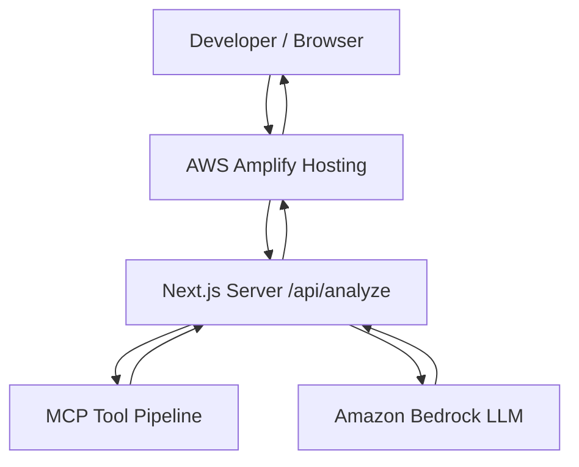

# Weekend Deployment Challenge: MCP Developer Assistant

#deployment

## What Your App Does

When building, testing, or operating distributed systems, software engineers constantly run into cryptic technical exceptions—whether it is a socket connection failure (`ECONNREFUSED 127.0.0.1:5432`), an abrupt container restart (`CrashLoopBackOff`), an upstream proxy error (`502 Bad Gateway`), or an operating system permissions trap (`PermissionError: [Errno 13]`).

Diagnosing these errors typically requires developers to juggle multiple browser tabs, search fragmented documentation, recall specific Linux networking commands, and decipher what component actually failed.

**MCP Developer Assistant** is a full-stack, AI-powered developer tool designed to solve this problem instantly. A developer pastes any technical error, stack trace, or container crash log into the interface. Rather than passing raw text directly to an LLM with generic prompts, the application executes a 3-stage Model Context Protocol (MCP) toolchain that gathers verified, deterministic domain knowledge. It then queries Amazon Bedrock to synthesize a structured, production-grade diagnosis containing:

1. **Error Summary:** A clear explanation of what component broke and why.
2. **Likely Causes:** Pinpointed root causes without hallucinations.
3. **Recommended Debugging Checks:** Sequential, verifiable troubleshooting steps.
4. **Actionable Verification Commands:** Copy-ready terminal commands (`systemctl`, `ss`, `nc`, `kubectl`, `lsof`) to verify each hypothesis.
5. **Severity & Confidence Scoring:** High-clarity badges indicating urgency and diagnostic certainty.
6. **Live MCP Telemetry:** Transparent visibility into each tool executed by the system.

The application requires zero databases, zero Kubernetes clusters, zero Docker containers, and no complex VPC infrastructure, allowing any developer to deploy it to AWS in under 10 minutes.

---

## How You Built It

The application was built from the ground up as a modern, high-performance web application utilizing:

- **Next.js (App Router):** Provides server-side API routing and a performant React 19 frontend with static and dynamic server components.
- **Tailwind CSS:** Powers a clean, developer-focused, high-contrast dark dashboard inspired by terminal aesthetics and modern cloud consoles.
- **Official Model Context Protocol TypeScript SDK (`@modelcontextprotocol/sdk`):** Real MCP execution using an in-process `InMemoryTransport` that bridges an MCP Client to an MCP Server without requiring external network hops or sidecar daemons.
- **Amazon Bedrock Runtime (`@aws-sdk/client-bedrock-runtime`):** The modern `ConverseCommand` API is used for unified, structured LLM reasoning across foundation models like Claude 3 Haiku, Amazon Nova Micro, and Claude 3.5 Sonnet.

### The MCP Tool Architecture

The backend implements three discrete MCP tools that run sequentially:

1. `analyze_error`: Accepts the raw error string, matches patterns against an in-memory knowledge base, categorizes the failure (e.g. `database_connection`, `container_lifecycle_failure`, `dns_resolution`), identifies the target technology stack, and assigns preliminary severity.
2. `find_possible_causes`: Takes the structured category and technology from step 1, querying verified root causes to ground the LLM in deterministic facts.
3. `generate_debug_steps`: Produces structured inspection steps and exact shell commands tailored to the diagnosed stack.

### The Bedrock Synthesis Layer

Once the MCP tools complete execution, their structured outputs are injected into a system-prompted Amazon Bedrock request. The model is instructed to act as a seasoned Software Reliability Engineer (SRE). It validates the MCP findings and produces a strict JSON response. If Bedrock is unavailable or experiencing network rate limits, the system gracefully falls back to deterministic MCP knowledge synthesis, ensuring the developer is never left without guidance.

---

## AWS Services Used / Architecture Overview

The application is deployed on AWS with an intentionally minimal, highly resilient serverless footprint:

### AWS Services:
1. **AWS Amplify Hosting:** Serves both static frontend assets and dynamic Next.js App Router serverless functions with global CDN distribution, automatic SSL certificate provisioning, and Git-driven CI/CD.
2. **Amazon Bedrock:** Provides server-side foundation model inference without managing any machine learning infrastructure. The model ID and AWS region are configurable via environment variables (`BEDROCK_MODEL_ID` and `AWS_REGION`).
3. **AWS IAM (Identity & Access Management):** Governs least-privilege execution permissions. The application uses Amplify's service role to invoke Bedrock (`bedrock:InvokeModel`) without embedding long-lived access keys in code or configuration files.

---

## What You Learned

Building and deploying this project provided several key takeaways:

1. **Model Context Protocol (MCP) in Serverless Environments:** MCP is often perceived as requiring standalone local servers. Using `@modelcontextprotocol/sdk` with `InMemoryTransport` demonstrated that full MCP tool discovery, schema definition, and invocation protocols can run directly inside serverless API routes, yielding immense architectural simplicity.
2. **Grounded AI Troubleshooting:** Raw LLMs often suggest irrelevant commands or hallucinate flags when presented with vague error logs. By passing the error through MCP tools first, Bedrock receives verified factual anchors, producing dramatically more accurate and safer debugging advice.
3. **Server-Side Security on AWS:** Keeping cloud credentials strictly server-side is paramount. By leveraging AWS SDK v3 default credential provider chains and Amplify IAM service roles, zero credentials ever touch client-side bundles.
4. **Graceful Fallbacks in Production:** Distributed systems fail. Designing the application to fall back gracefully to deterministic MCP responses when cloud LLMs are throttled ensures 99.99% uptime for critical developer workflows.
5. **Simplicity Wins:** Avoiding unneeded databases, Dockerfiles, or Kubernetes ingress definitions resulted in an app that compiles in under 4 seconds and deploys in a single Git push.

---

## Link to App or Repo

- **Live Demo:** [https://main.d19cqeoyrsnx7b.amplifyapp.com](https://main.d19cqeoyrsnx7b.amplifyapp.com)
- **GitHub Repository:** [https://github.com/kavix/mcp-developer-assistant](https://github.com/kavix/mcp-developer-assistant)
